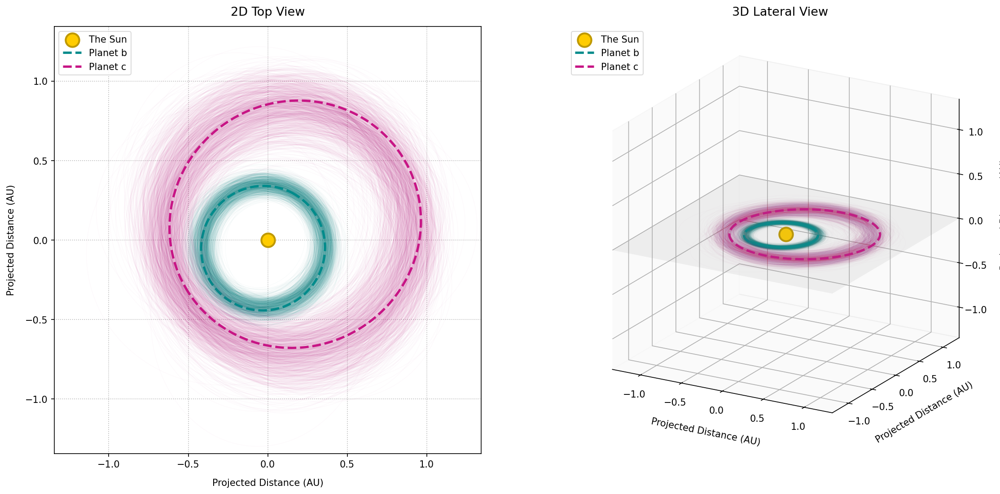
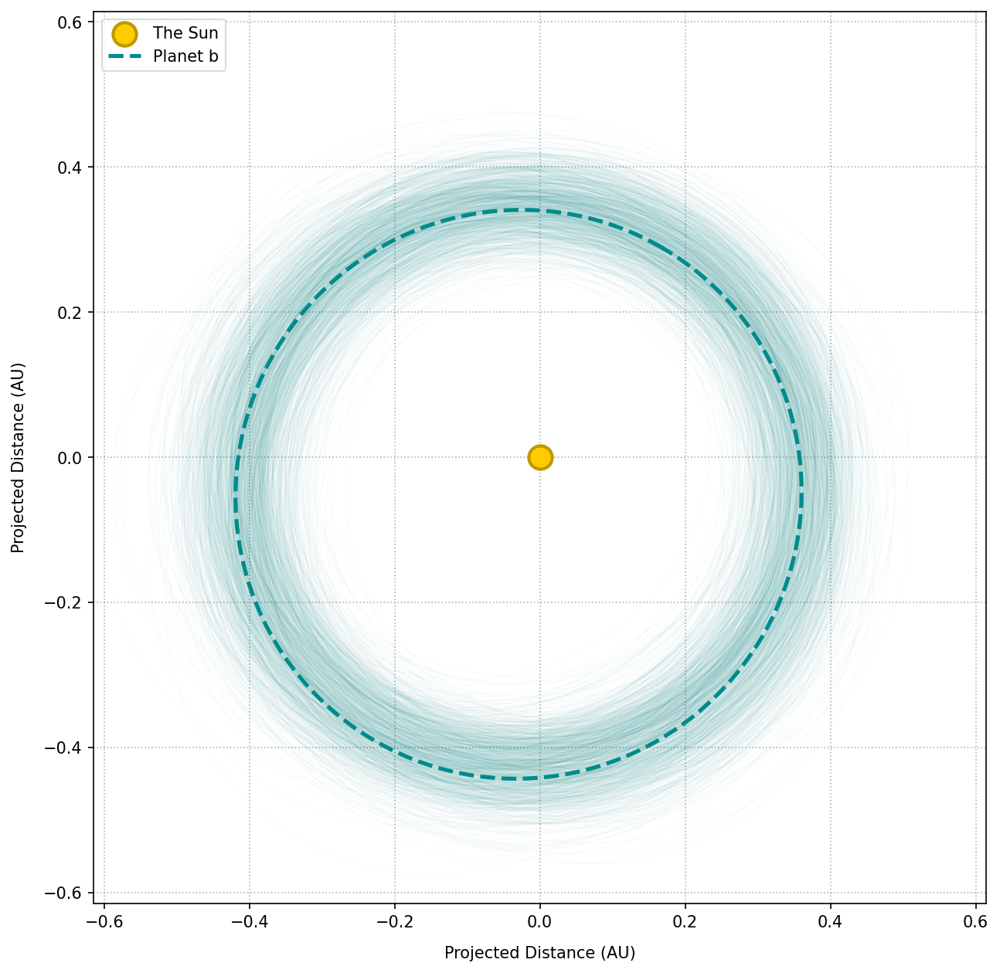
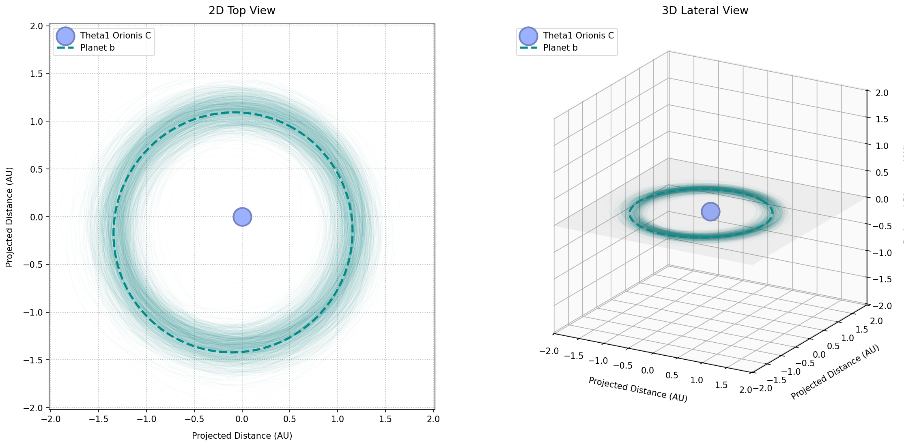

# orbcloud

[](https://doi.org/10.5281/zenodo.20935725)


`orbcloud` is a Python package designed to transform simulated exoplanet parameter posteriors (such as MCMC chains) into physical 3D orbital probability density clouds.

By plotting thousands of orbits, the overlapping threads naturally highlight the high-probability regions of 3D orbital space, creating a beautiful and physically accurate visualization.

> [!TIP]
> In addition to visualization, `orbcloud` can be useful to rule out possible dynamical instability in the system. Visually mapping the orbital probability clouds allows researchers to quickly identify overlapping orbital regions. This helps save significant time and computational resources by avoiding expensive N-body simulations if a visual inspection already reveals that the system is most likely going to be unstable anyway.

---


## Installation

```bash
pip install orbcloud
```

Dependencies: `numpy`, `matplotlib`

---

## Quickstart

### Step 1: Initialize the System
Configure the central star's name, mass, and spectral type (e.g. O, B, A, F, G, K, M). By default, a Sun-like star is used.

```python
import matplotlib.pyplot as plt
from orbcloud import PlanetConfig, SystemEnsemble

# Initialize a system centered around a Sun-like star
system = SystemEnsemble(star_id='sun')
```

### Step 2: Configure and Add Planets
Define the planet's geometric parameters (orbital period, eccentricity, argument of periastron, etc.) using `PlanetConfig`, and add it to the ensemble to simulate the posterior distribution.

```python
# 1. Inner planet 'b'
planet_b = PlanetConfig(
    name='Planet b',
    P_mean=90.0, P_std=8.0,
    omega_mean_deg=60.0, omega_std_deg=40.0,
    e_mean=0.15, e_std=0.09,
    i_deg=0.0, Omega_deg=0.0
)

# 2. Outer planet 'c'
planet_c = PlanetConfig(
    name='Planet c',
    P_mean=260.0, P_std=14.0,
    omega_mean_deg=210.0, omega_std_deg=45.0,
    e_mean=0.25, e_std=0.10,
    i_deg=0.0, Omega_deg=0.0
)

# Simulate 1000 posterior paths per planet and compute 3D coordinate clouds
system.add_planet(planet_b, num_samples=1000)
system.add_planet(planet_c, num_samples=1000)
```

### Step 3: Visualize the Full Probability Cloud
By default, `plot_system()` will generate both 2D and 3D subplots side-by-side.

```python
# Render both 2D (top-down) and 3D (oblique lateral) views
system.plot_system(show_reference_plane=True)
plt.savefig('system_both_views.png', dpi=150, facecolor='white', bbox_inches='tight')
plt.show()
```



### Step 4: Filtering Planet Visibility or Projection
If you want to view a single projection (e.g. 2D top-down view only) or isolate a specific planet, pass the `dimension` and `planets_to_show` filters:

```python
# Render 2D top view only for Planet b
system.plot_system(dimension='2d', planets_to_show=['Planet b'])
plt.savefig('planet_b_2d_only.png', dpi=150, facecolor='white', bbox_inches='tight')
plt.show()
```



### Step 5: Defining a Custom Star
You can configure the central star's size, glow, and color dynamically using real-world reference stars (e.g. "Vega" or "Barnard's Star", or "Theta1 Orionis C"):

```python
# Initialize a system centered around a custom massive O-type star (Theta1 Orionis C)
system_custom = SystemEnsemble(star_id='theta1')

# Add the inner planet 'b'
system_custom.add_planet(planet_b, num_samples=1000)

# Plot the system to see the custom blue central star!
system_custom.plot_system(show_reference_plane=True)
plt.savefig('custom_star_both_views.png', dpi=150, facecolor='white', bbox_inches='tight')
plt.show()
```




---

## License

This project is licensed under the MIT License.
