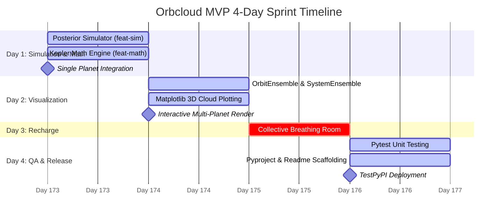

# Orbcloud: Code/Astro Workshop MVP Roadmap

This roadmap outlines a 4-day sprint to build **orbcloud**, a Python package designed to transform simulated exoplanet parameter posteriors into beautiful, physical 3D orbital probability clouds.

---

## 📅 Day 1: Parameter Simulation & Coordinate Math
* **Goal**: Generate simulated parameter distributions and translate them into arrays of $(x, y, z)$ spatial vectors for a single planet.
* **Git Strategy**: Keep `main` locked. Develop in two parallel branches and merge:
  * `feat-sim` (Direct posterior simulation of $P, K, t_0, \omega, e$)
  * `feat-kepler-math` (Keplerian physics, real stellar mass mapping, & coordinate transformations)

### Task Breakdown

| Feature Branch | Task Description | Dependencies / Tech |
| :--- | :--- | :--- |
| **`feat-sim`** | Write a lightweight generator to simulate orbital parameters (e.g. normal distribution for inclinations around a mean, log-normal or beta distributions for eccentricity, etc.) from typical RV parameters. | `numpy` |
| **`feat-kepler-math`** | Implement vectorized Newton-Raphson solver for Kepler's Equation. Implement physical mass scaling using **Real Reference Stars** (e.g. Barnard's Star for M-dwarfs, Vega for A-stars, Upsilon Andromedae for F-stars) to scale the semi-major axis $a$ via Kepler's Third Law. | `numpy` |

> [!IMPORTANT]
> **Day 1 Milestone**: Verify that passing a mock simulated single-planet dataset returns a clean $(N_{\text{samples}}, N_{\text{phase\_points}}, 3)$ array of coordinates. Merge both branches into `main`.

---

## 📅 Day 2: The 3D Alpha-Cloud & Multi-Planet Customization
* **Goal**: Extend the core logic to support multiple planets, stellar customization, and selective visualization.
* **Git Strategy**: Pair program on a shared `feat-visualization` branch.

### Task Breakdown

- **Object-Oriented API**:
  - Implement `OrbitEnsemble` representing a single planet's orbits.
  - Implement a `SystemEnsemble` to aggregate multiple planets, each with its own simulated posterior distribution.
  - Allow users to filter/select which planets to display: `system.plot_3d_cloud(planets_to_show=['b', 'c'])`.
- **Stellar Customization**:
  - Configure the central star's size, glow radius, and color to dynamically change based on its **Real Star ID** (e.g. "Barnard's Star" renders as a small red dwarf, "Vega" as a large blue-white A-type star).
- **Minimalist Matplotlib Aesthetics**:
  - Force orthographic projection (`ax.set_proj_type('ortho')`).
  - Hide axis lines, gridlines, and grey panes to create a floating stellar system effect.
  - Apply custom low opacity (`alpha=0.02` to `0.05` per line) so overlapping lines naturally map the probability clouds.

> [!TIP]
> **Day 2 Milestone**: Run the system on a simulated multi-planet system and capture a high-res screenshot of the customized, filtered orbital clouds.

---

## 📅 Day 3: Collective Breathing Room
* **Goal**: Mental reset.
* **Activities**: Explore Santa Cruz, hit the beach, or hike the redwoods. No heavy coding.

---

## 📅 Day 4: Robust Testing & PyPI Deployment
* **Goal**: Package the code so anyone can run `pip install orbcloud`.

### Task Breakdown

- **Robust Unit Testing (`pytest`)**:
  - Test case: $e = 0$ yields a perfect circle.
  - Test case: $i = 0^\circ$ restricts all motion to the $X$-$Y$ plane ($Z = 0$).
  - Test case: Kepler equation solver converges correctly for high eccentricities.
  - Test case: Multi-planet filter successfully excludes requested planets from the output plot.
- **Packaging Scaffolding**:
  - Write standard `pyproject.toml` configuration.
  - Write a clean `README.md` with an example simulation script demonstrating stellar selection (e.g. "Barnard's Star") and planet visibility toggles.
  - Upload to **TestPyPI**.

> [!IMPORTANT]
> **Day 4 Milestone**: Successfully run `pip install -i https://test.pypi.org/simple/ orbcloud` in a clean environment and run a quick multi-planet visualization test.
